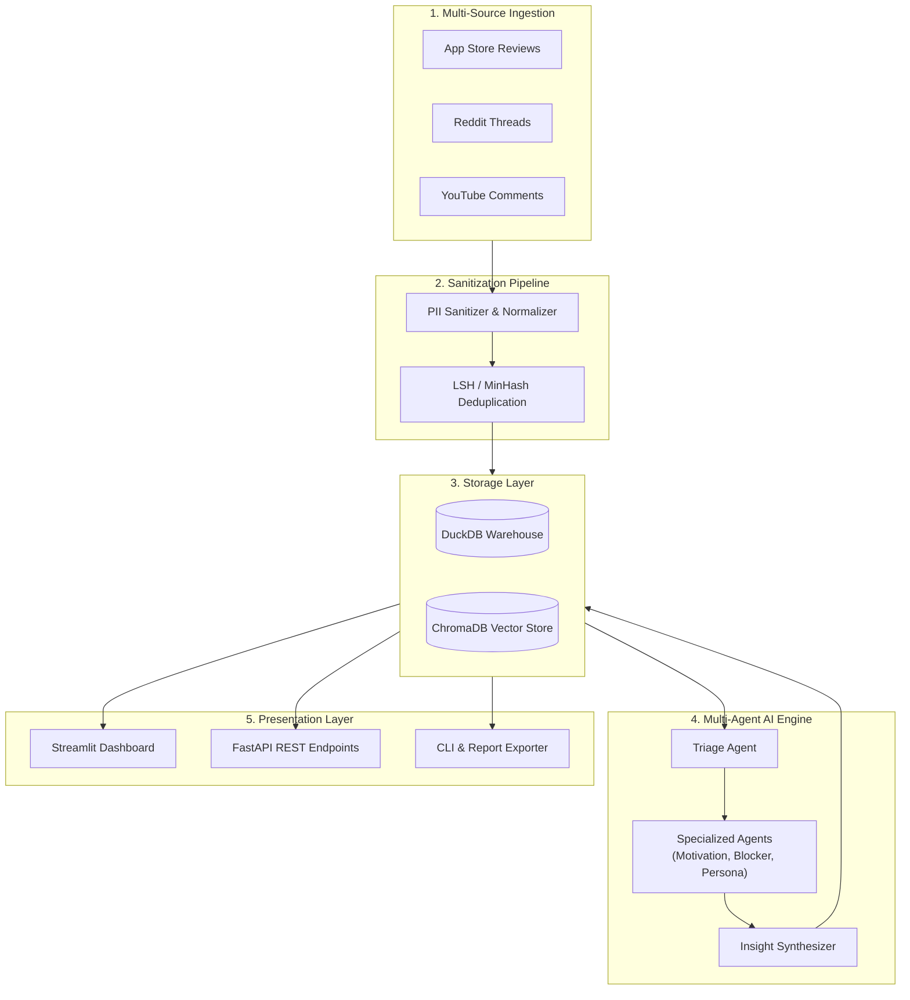

# AI-Powered Discovery Engine for Myntra Wishlist-to-Purchase Behavior


An enterprise-grade, multi-agent AI discovery and analytical engine designed to quantify unstructured public user feedback regarding Myntra wishlist-to-purchase behavior. By processing user reviews, Reddit discussions, and YouTube haul feedback through specialized AI agents, vector embeddings, and an analytical data warehouse, the engine translates qualitative customer frustration into quantified opportunity matrices and actionable product recommendations.

---

## 📌 Table of Contents

- [Overview & Key Features](#-overview--key-features)
- [System Architecture](#-system-architecture)
- [Tech Stack](#-tech-stack)
- [Project Directory Structure](#-project-directory-structure)
- [Installation & Setup](#-installation--setup)
- [Commands to Run Project](#-commands-to-run-project)
  - [1. Streamlit Interactive Dashboard](#1-streamlit-interactive-dashboard)
  - [2. FastAPI REST Service](#2-fastapi-rest-service)
  - [3. Unified Command-Line Interface (CLI)](#3-unified-command-line-interface-cli)
  - [4. Docker & Docker Compose](#4-docker--docker-compose)
  - [5. Running Automated Tests](#5-running-automated-tests)
- [Deployment](#-deployment)
- [License & Security](#-license--security)

---

## 💡 Overview & Key Features

*   **Multi-Source Data Ingestion**: Ingests public user reviews from Google Play Store / App Store, Reddit fashion communities (`r/IndianFashionAddicts`), and YouTube comment threads.
*   **PII Stripping & Domain Normalization**: Strips personal identifiable information (emails, handles, phone numbers) and normalizes Indian fashion e-commerce domain terms (`COD`, `OOTD`, `BOGO`, size terms).
*   **Multi-Agent AI Pipeline**:
    *   **Triage Agent**: Routes raw posts based on relevance and quality.
    *   **Motivation Agent**: Classifies impulse saving, price monitoring, outfit planning, or social validation intent.
    *   **Blocker Agent**: Detects conversion blockers (sizing ambiguity, discount waiting, stock out, return policy concerns).
    *   **Social Validation Agent**: Evaluates peer influence and try-on haul impact.
    *   **User Segmentation Agent**: Categorizes users into Bargain Hunters, Fashion Enthusiasts, Occasional Buyers, etc.
*   **Hybrid Analytical & Vector Storage**: Combines **DuckDB** for relational aggregations with **ChromaDB** for semantic similarity search and vector clustering.
*   **Opportunity Area Scoring**: Quantifies friction points using business impact scoring:
    $$\text{Opportunity Score} = F \times \overline{I} \times S$$
    *(where $F$ = Frequency, $\overline{I}$ = Average Intent, $S$ = Severity Factor)*
*   **Interactive Streamlit Dashboard**: Provides executive metrics, conversion funnel drop-off diagnostics, interactive 2D cluster maps, and automated markdown report export.
*   **FastAPI REST Endpoints**: Exposes programmatically queryable endpoints for external UI/frontend consumption.

---

## 🏗️ System Architecture



---

## 🛠️ Tech Stack

| Category | Technology / Library | Purpose |
| :--- | :--- | :--- |
| **Language** | Python 3.11+ | Primary application language |
| **User Interface** | Streamlit, Plotly, Altair | Interactive executive analytics dashboard |
| **Backend REST API** | FastAPI, Uvicorn | High-performance ASGI REST API service |
| **Data Warehouse** | DuckDB | Embedded analytical SQL data store |
| **Vector Database** | ChromaDB | Local vector store for embeddings and clustering |
| **AI / Multi-Agent Framework** | Pydantic v2, Custom Orchestrator | Data schema validation & multi-agent pipeline |
| **NLP & Preprocessing** | Sentence-Transformers, SpaCy, Regex | Text embedding, PII stripping & deduplication |
| **CLI & Tools** | Argparse | Unified command-line interface |
| **Testing** | Pytest, Pytest-Cov | Automated unit and integration test suite |
| **Containerization** | Docker, Docker Compose | Production container runtime environment |
| **Cloud Deployment** | Railway | Cloud hosting & continuous deployment |

---

## 📂 Project Directory Structure

```
ai-powered-discovery-engine/
├── .env.example                  # Environment variable template
├── .dockerignore                 # Docker build ignore patterns
├── Dockerfile                    # Production multi-stage Dockerfile
├── docker-compose.yml            # Local container orchestra configuration
├── railway.json                  # Railway deployment configuration
├── deployment.md                 # Step-by-step Railway deployment guide
├── architecture.md               # Complete architectural technical specification
├── problemstatement.md           # Business problem statement & scope
├── requirements.txt              # Production Python package dependencies
├── README.md                     # Project documentation overview
├── configs/                      # Global engine configuration YAML files
├── data/                         # Local database storage (DuckDB & ChromaDB)
├── reports/                      # Exported markdown executive briefs
├── scripts/                      # Utility scripts for data inspection & manual audits
│   ├── inspect_reviews.py
│   └── view_raw_posts.py
├── src/                          # Core application source code
│   ├── api.py                    # FastAPI REST API server
│   ├── cli.py                    # Unified command-line interface
│   ├── agents/                   # Specialized AI Agents & Orchestrator
│   │   ├── base_agent.py
│   │   ├── triage_agent.py
│   │   ├── motivation_agent.py
│   │   ├── blocker_agent.py
│   │   ├── social_validation_agent.py
│   │   ├── segmentation_agent.py
│   │   └── orchestrator.py
│   ├── analytics/                # Scoring, clustering & SQL aggregations
│   │   ├── aggregations.py
│   │   ├── clustering.py
│   │   └── scoring.py
│   ├── dashboard/                # Streamlit UI & Executive Brief Generator
│   │   ├── app.py
│   │   └── report_generator.py
│   ├── ingestion/                # Multi-source connectors & preprocessing
│   │   ├── app_store_connector.py
│   │   ├── reddit_connector.py
│   │   ├── youtube_connector.py
│   │   ├── datasets.py
│   │   └── pipeline.py
│   ├── models/                   # Pydantic schemas and domain data models
│   ├── preprocessing/            # Sanitization, PII removal, deduplication
│   ├── storage/                  # DuckDB & ChromaDB database managers
│   └── utils/                    # Security auditors & helper modules
└── tests/                        # Comprehensive Pytest test suite
    ├── test_agents.py
    ├── test_analytics.py
    ├── test_dashboard.py
    ├── test_ingestion.py
    ├── test_preprocessing.py
    ├── test_schemas.py
    └── test_storage.py
```

---

## ⚡ Installation & Setup

### 1. Clone Repository & Setup Virtual Environment

```bash
# Clone the repository
git clone https://github.com/anni-git1990/ai-powered-discovery-engine.git
cd ai-powered-discovery-engine

# Create a virtual environment
python -m venv .venv

# Activate virtual environment
# Windows:
.venv\Scripts\activate
# Linux/macOS:
source .venv/bin/activate
```

### 2. Install Dependencies

```bash
pip install --upgrade pip
pip install -r requirements.txt
```

### 3. Environment Variables Setup

Copy `.env.example` to `.env` and configure your API keys if executing live scraping or external LLM inference:

```bash
cp .env.example .env
```

---

## 🚀 Commands to Run Project

### 1. Streamlit Interactive Dashboard

To launch the primary Web UI dashboard locally:

```bash
streamlit run src/dashboard/app.py
```
*The dashboard will automatically open in your browser at `http://localhost:8501`.*

### 2. FastAPI REST Service

To run the backend REST API server with interactive Swagger UI documentation:

```bash
uvicorn src.api:app --reload --host 0.0.0.0 --port 8000
```
*Access API Docs at:*
*   **Swagger UI**: `http://localhost:8000/docs`
*   **ReDoc**: `http://localhost:8000/redoc`

### 3. Unified Command-Line Interface (CLI)

The repository provides a single CLI entry point (`src/cli.py`) to execute administrative tasks:

#### Run End-to-End Discovery Pipeline
```bash
python src/cli.py run-pipeline --limit 50 --db-path data/discovery_engine.duckdb
```

#### Export Executive Brief Report
```bash
python src/cli.py export-report --output reports/executive_discovery_brief.md
```

#### Run PII Security & Privacy Compliance Audit
```bash
python src/cli.py audit-pii
```

### 4. Docker & Docker Compose

#### Run via Docker Compose (Recommended)
```bash
docker-compose up --build
```
*Access the dashboard at `http://localhost:8501`.*

#### Run via Docker CLI
```bash
# Build Docker image
docker build -t myntra-discovery-engine .

# Run container
docker run -p 8501:8501 -v $(pwd)/data:/app/data myntra-discovery-engine
```

### 5. Running Automated Tests

Run the complete unit and integration test suite using `pytest`:

```bash
# Run all tests
pytest

# Run tests with detailed verbose output and code coverage
pytest -v --cov=src
```

---

## ☁️ Deployment

This project is optimized for automated deployment on **Railway**. Refer to the comprehensive deployment guide:

📄 **[Railway Deployment Guide (`deployment.md`)](file:///d:/anita/product-AI-training/ai-powered-discovery-engine/deployment.md)**

Quick Railway CLI deploy:
```bash
railway up
```

---

## 🔒 License & Security

- **PII Compliance**: All text passed through the pipeline is automatically sanitized to remove emails, handles, and personal data.
- **License**: MIT License. Free for enterprise analytical use.
