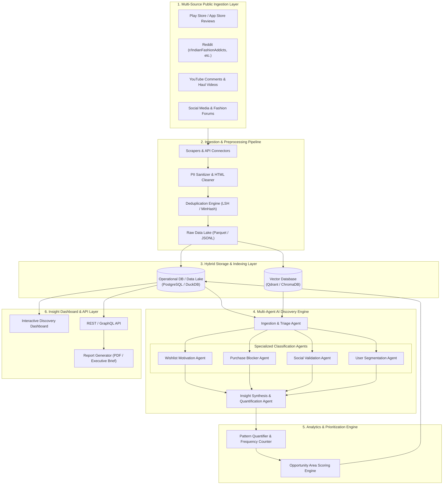
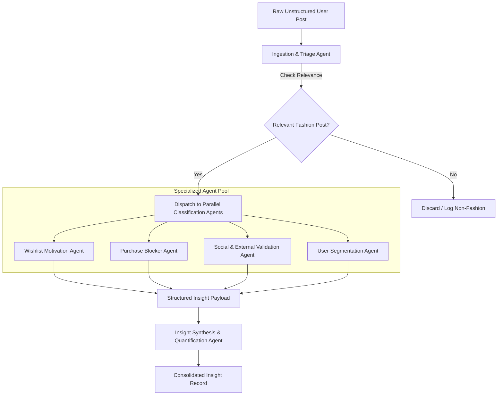

# Architecture Specification: AI-Powered Discovery Engine for Myntra Wishlist-to-Purchase Behavior

## 1. System Overview & High-Level Architecture

The **AI-Powered Discovery Engine** is designed to systematically ingest, analyze, synthesize, and quantify unstructured public user feedback surrounding Myntra wishlist-to-purchase behavior. It leverages a multi-agent AI pipeline combined with vector embeddings and analytical data stores to transform raw conversational data into actionable product discovery insights.

### High-Level Architecture Diagram



---

## 2. Ingestion & Preprocessing Pipeline

### 2.1 Data Sources & Collectors
The ingestion layer connects to external public platforms using dedicated connector modules:
- **App Store / Google Play Connector:** Fetches public user reviews for the Myntra app focusing on keywords like `wishlist`, `saved`, `size`, `price`, `return`.
- **Reddit Connector:** Uses PRAW / Async HTTP to scrape threads and comments from fashion subreddits (e.g., `r/IndianFashionAddicts`, `r/DesiFragranceAddicts`, `r/ShoppingDealsIndia`).
- **YouTube Connector:** Interrogates YouTube Data API v3 for comments on fashion try-on hauls, Myntra review videos, and styling recommendations.
- **Web & Community Scraper:** Scrapes public fashion blogs, Q&A sites, and community forums.

### 2.2 Preprocessing & Sanitization
1. **PII Stripping & Anonymization:** Removes email addresses, phone numbers, personal handles, and names using Regex & SpaCy NER.
2. **Noise Reduction:** Filters out spam, bot submissions, non-English posts (or applies auto-translation), and short irrelevant text (< 5 words).
3. **Canonical Normalization:** Normalizes slang (e.g., "OOTD", "COD", "BOGO", "haul", "cart") into canonical domain terms.
4. **Deduplication:** Applies MinHash / Locality Sensitive Hashing (LSH) to eliminate cross-posted or duplicate comments.

---

## 3. Storage & Vector Indexing Layer

The platform utilizes a hybrid storage architecture balancing analytical query performance with semantic vector search.

```
                    ┌──────────────────────────────────────────┐
                    │            Raw Input Text                │
                    └─────────────────────┬────────────────────┘
                                          │
                  ┌───────────────────────┴───────────────────────┐
                  ▼                                               ▼
    ┌───────────────────────────┐                   ┌───────────────────────────┐
    │     Relational DB         │                   │      Vector Database      │
    │    (DuckDB / Postgres)    │                   │    (ChromaDB / Qdrant)    │
    ├───────────────────────────┤                   ├───────────────────────────┤
    │ - Source Metadata         │                   │ - Dense Text Embeddings   │
    │ - Timestamps & Platforms  │                   │   (bge-m3 / text-3-large) │
    │ - Structured Classifications│                 │ - Payload: Post ID,       │
    │ - Aggregated Metrics      │                   │   Snippet, Source         │
    └───────────────────────────┘                   └───────────────────────────┘
```

- **Relational Data Warehouse (DuckDB / PostgreSQL):** Stores structured metadata, source lineage, agent execution logs, and classified insights for aggregation.
- **Vector Database (Qdrant / ChromaDB):** Stores 1024-d / 1536-d text embeddings generated via `bge-m3` or `text-embedding-3-large` for semantic RAG queries, semantic clustering, and similarity search.

---

## 4. Multi-Agent AI Processing Engine

The core discovery logic is powered by a multi-agent orchestration framework (e.g., LangGraph / CrewAI) built with domain-specific LLM prompts and structured outputs (JSON/Pydantic schemas).



### 4.1 Agent Responsibilities

#### Agent 1: Ingestion & Triage Agent
- **Goal:** Filter noise and route valid fashion-shopping conversations.
- **Output:** Relevance Score (0-1), Primary Category (Wishlist, Size/Fit, Price, General Review).

#### Agent 2: Wishlist Motivation Agent
- **Goal:** Classify why the user wishlisted the item and measure purchase intent.
- **Taxonomy Categories:**
  - `HIGH_BUYING_INTENT` (Immediate intent, awaiting final check)
  - `PRICE_DISCOUNT_WATCH` (Waiting for sale/coupon)
  - `STYLING_OCCASION_MATCHING` (Saving for specific event/outfit creation)
  - `COMPARISON_DECISION` (Comparing against alternate options)
  - `LOW_INTENT_BOOKMARKING` (Aesthetic collection, casual browse)

#### Agent 3: Purchase Blocker & Friction Agent
- **Goal:** Extract explicit and implicit barriers preventing purchase.
- **Taxonomy Categories:**
  - `SIZE_FIT_UNCERTAINTY` (Fear of wrong size, inconsistent sizing)
  - `PRICE_VALUE_SKEPTICISM` (Overpriced without discount)
  - `QUALITY_FABRIC_CONCERN` (Doubts about material, durability, color accuracy)
  - `REVIEW_TRUST_DEFICIT` (Lack of verified reviews/real photos)
  - `DELIVERY_RETURN_FRICTION` (High delivery charges, return hassle)

#### Agent 4: Social & External Validation Agent
- **Goal:** Identify off-platform research behavior and validation channels.
- **Taxonomy Categories:**
  - `YOUTUBE_HAUL_SEARCH` (Looking for video try-ons)
  - `INSTAGRAM_INFLUENCER_LOOKUP` (Checking influencer styling)
  - `REDDIT_COMMUNITY_ADVICE` (Asking subreddits for real feedback)
  - `CROSS_PLATFORM_PRICE_CHECK` (Comparing price on Amazon/Flipkart/Brand site)

#### Agent 5: User Segmentation Agent
- **Goal:** Assign conversational feedback to target user personas.
- **Personas:**
  - `BUDGET_SENSITIVE_SAVVER`
  - `FIT_CONSCIOUS_BUYER`
  - `TREND_OCCASION_SHOPPER`
  - `QUALITY_SEEKER`

#### Agent 6: Insight Synthesis & Quantification Agent
- **Goal:** Deduplicate, aggregate, and calculate statistical frequency and severity metrics.

---

## 5. Data Taxonomy & Schema Definitions

### 5.1 Raw Post Schema (`raw_posts`)
```json
{
  "$schema": "http://json-schema.org/draft-07/schema#",
  "title": "RawPost",
  "type": "object",
  "properties": {
    "post_id": { "type": "string" },
    "source_platform": { "type": "string", "enum": ["PLAY_STORE", "APP_STORE", "REDDIT", "YOUTUBE", "FORUM"] },
    "author_hash": { "type": "string" },
    "timestamp": { "type": "string", "format": "date-time" },
    "raw_text": { "type": "string" },
    "cleaned_text": { "type": "string" },
    "engagement_metrics": {
      "type": "object",
      "properties": {
        "upvotes": { "type": "integer" },
        "replies": { "type": "integer" }
      }
    }
  },
  "required": ["post_id", "source_platform", "raw_text", "cleaned_text"]
}
```

### 5.2 Analyzed Insight Schema (`analyzed_insights`)
```json
{
  "$schema": "http://json-schema.org/draft-07/schema#",
  "title": "AnalyzedInsight",
  "type": "object",
  "properties": {
    "insight_id": { "type": "string" },
    "post_id": { "type": "string" },
    "wishlist_motivation": {
      "type": "string",
      "enum": ["HIGH_BUYING_INTENT", "PRICE_DISCOUNT_WATCH", "STYLING_OCCASION_MATCHING", "COMPARISON_DECISION", "LOW_INTENT_BOOKMARKING"]
    },
    "intent_score": { "type": "number", "minimum": 0.0, "maximum": 1.0 },
    "primary_blocker": {
      "type": "string",
      "enum": ["SIZE_FIT_UNCERTAINTY", "PRICE_VALUE_SKEPTICISM", "QUALITY_FABRIC_CONCERN", "REVIEW_TRUST_DEFICIT", "DELIVERY_RETURN_FRICTION", "NONE"]
    },
    "secondary_blockers": {
      "type": "array",
      "items": { "type": "string" }
    },
    "external_validation_channel": { "type": "string" },
    "user_segment": { "type": "string" },
    "extracted_quotes": {
      "type": "array",
      "items": { "type": "string" }
    },
    "confidence_score": { "type": "number", "minimum": 0.0, "maximum": 1.0 }
  },
  "required": ["insight_id", "post_id", "wishlist_motivation", "intent_score", "primary_blocker"]
}
```

---

## 6. Analytics, Scoring & Prioritization Engine

### 6.1 Opportunity Area Prioritization Metric
To help product leadership decide which problem to solve first, the discovery engine computes a standardized **Opportunity Score** for each identified blocker/theme:

$$\text{Opportunity Score} = F \times \bar{I} \times S$$

Where:
- $F$ = **Frequency Count:** Total volume of user posts mentioning this friction point.
- $\bar{I}$ = **Average Purchase Intent:** Mean intent score ($0.0 - 1.0$) of users experiencing this blocker (prioritizes high-intent drop-offs).
- $S$ = **Severity Weight:** Rated scale ($1.0 - 3.0$) based on whether the blocker completely halts purchase vs. merely delays it.

### 6.2 Clustering & Unmet Need Extraction
- **HDBSCAN Vector Clustering:** Embeddings of posts with `HIGH_BUYING_INTENT` but `NO_PURCHASE` are clustered to detect emerging, unclassified user friction patterns.
- **LLM Topic Summarizer:** Automatically generates natural language titles and descriptions for newly discovered clusters.

---

## 7. Interactive Discovery Dashboard & Interface Layer

The presentation layer provides product managers and decision-makers with interactive exploration tools:

```
┌─────────────────────────────────────────────────────────────────────────────┐
│ MYNTRA WISHLIST DISCOVERY ENGINE - EXECUTIVE INSIGHT DASHBOARD              │
├─────────────────────────────────────────────────────────────────────────────┤
│  Total Feedback Analyzed: 142,500   |   High-Intent Drop-offs: 38.4%       │
├─────────────────────────────────────┬───────────────────────────────────────┤
│ Top Conversion Blockers             │ Wishlist Motivation Breakdown         │
│  1. Size & Fit Uncertainty  [34%]   │  - Price/Discount Watch       [41%]   │
│  2. Fabric/Quality Trust    [22%]   │  - Genuine Buying Intent      [28%]   │
│  3. Price / Waiting Discount [19%]  │  - Low-Intent Bookmarking     [18%]   │
│  4. Lack of Real Try-on Pics[14%]   │  - Occasion/Styling Match     [13%]   │
├─────────────────────────────────────┴───────────────────────────────────────┤
│ Opportunity Matrix (Frequency vs. Intent)                                  │
│                                                                             │
│   High Intent │   [Size & Fit Confidence]  *PRIORITY 1*                     │
│               │   [Real Review Trust]      *PRIORITY 2*                     │
│    Low Intent │   [Aesthetic Moodboard]    *LOW PRIORITY*                   │
│               └────────────────────────────────────────                     │
│                   Low Frequency               High Frequency                │
└─────────────────────────────────────────────────────────────────────────────┘
```

- **Friction Heatmap & Funnel:** Visualizes drop-off reasons across user segments.
- **Verbatim Quote Explorer:** Enables PMs to click on any blocker and view real, anonymized user quotes from Reddit, YouTube, or App reviews.
- **Export & Brief Generator:** Outputs structured Markdown/PDF summaries for product strategy alignment.

---

## 8. Technology Stack

| Layer | Technology Selected | Justification |
| :--- | :--- | :--- |
| **Language** | Python 3.11+ | Ecosystem support for AI, NLP, scrapers, and data engineering. |
| **Orchestration** | LangGraph / CrewAI | State graph support for multi-agent workflows with conditional branching. |
| **LLMs / Models** | OpenAI GPT-4o / Claude 3.5 Sonnet | High precision for complex JSON classification & nuance extraction. |
| **Embeddings** | `bge-m3` / OpenAI `text-embedding-3-large` | Strong multilingual & domain-specific embedding performance. |
| **Vector DB** | ChromaDB / Qdrant | Fast hybrid search (sparse + dense) with payload filtering. |
| **Relational DB** | DuckDB / PostgreSQL | High-performance analytical query processing for local and server deployment. |
| **Data Cleaning** | SpaCy, Regex, ftfy | Fast PII stripping, text cleaning, and tokenization. |
| **Dashboard** | Streamlit / Next.js + Recharts | Rapid prototyping of interactive discovery dashboards. |

---

## 9. Security, Privacy & Compliance

1. **PII Removal Guarantee:** Automated PII scrubbers ensure zero personally identifiable information enters vector or LLM pipelines.
2. **Public Data Terms Compliance:** Crawlers strictly respect `robots.txt`, rate limits, and API terms of service.
3. **Model Caching & Cost Guardrails:** Redis semantic caching prevents redundant LLM calls for similar conversational snippets, keeping operational costs low.
