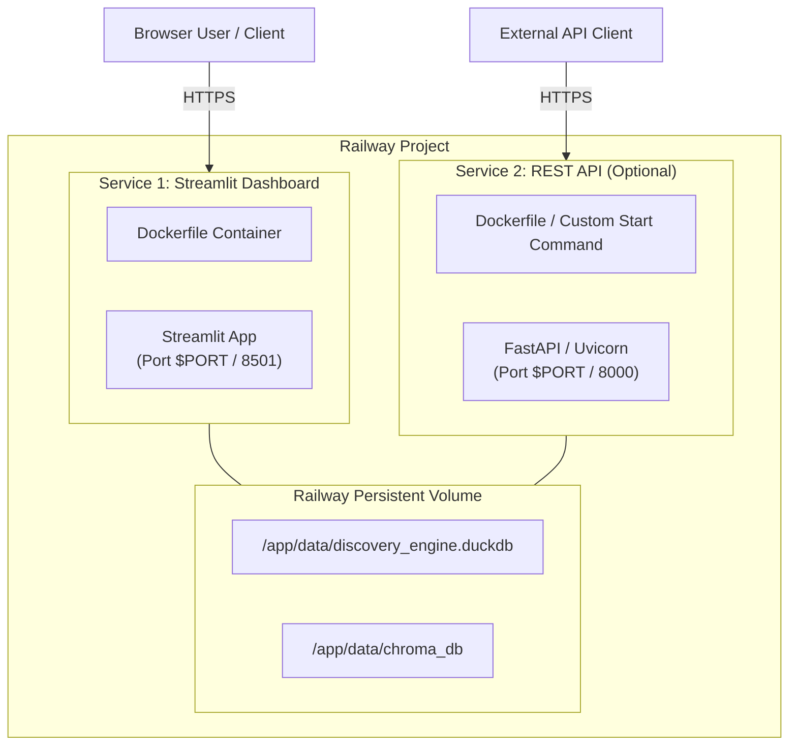

# Railway Deployment Guide: AI-Powered Discovery Engine

This document provides a comprehensive guide for deploying the **AI-Powered Discovery Engine** (Streamlit Dashboard & FastAPI REST API) to [Railway](https://railway.com/).

---

## Table of Contents

1. [Overview & Architecture on Railway](#1-overview--architecture-on-railway)
2. [Prerequisites](#2-prerequisites)
3. [Deployment Options](#3-deployment-options)
   - [Option A: Deploy via GitHub Integration (Recommended)](#option-a-deploy-via-github-integration-recommended)
   - [Option B: Deploy via Railway CLI](#option-b-deploy-via-railway-cli)
   - [Option C: Deployment with `railway.json`](#option-c-deployment-with-railwayjson)
4. [Environment Variables Reference](#4-environment-variables-reference)
5. [Multi-Service Configuration (Dashboard vs REST API)](#5-multi-service-configuration-dashboard-vs-rest-api)
6. [Persistent Storage Setup (Volumes for DuckDB & ChromaDB)](#6-persistent-storage-setup-volumes-for-duckdb--chromadb)
7. [Health Checks & Domain Setup](#7-health-checks--domain-setup)
8. [Troubleshooting & Common Edge Cases](#8-troubleshooting--common-edge-cases)

---

## 1. Overview & Architecture on Railway

The **AI-Powered Discovery Engine** is built using Python 3.11, Streamlit, FastAPI, DuckDB, and ChromaDB. On Railway, the application can be deployed as:

*   **Primary Web Service:** Streamlit Interactive Dashboard (`src/dashboard/app.py`).
*   **Secondary Web Service (Optional):** FastAPI REST API (`src/api.py`).

### Railway Infrastructure Layout



---

## 2. Prerequisites

Before starting the deployment, ensure you have:

1.  A **Railway Account** (Sign up at [railway.com](https://railway.com/)).
2.  The repository pushed to **GitHub** (or GitLab/Bitbucket).
3.  (Optional) **Railway CLI** installed locally for manual deployments:
    ```bash
    npm i -g @railway/cli
    ```
4.  API Keys for external services (OpenAI, Anthropic, YouTube API, Reddit API) as required by your environment setup.

---

## 3. Deployment Options

### Option A: Deploy via GitHub Integration (Recommended)

1.  **Log in to Railway** and navigate to the Dashboard.
2.  Click **"New Project"** -> Select **"Deploy from GitHub repo"**.
3.  Select the `ai-powered-discovery-engine` repository.
4.  Railway will automatically detect the root `Dockerfile` and initiate a build.
5.  Click on the newly created service card and navigate to **Settings**:
    *   **Build Command:** Auto-detected from `Dockerfile`.
    *   **Start Command:** Auto-detected from `Dockerfile` (`CMD ["streamlit", "run", "src/dashboard/app.py", "--server.port=8501", "--server.address=0.0.0.0"]`).
    *   *Note:* To bind dynamically to Railway's allocated `$PORT`, update the start command in Railway Settings:
        ```bash
        sh -c "streamlit run src/dashboard/app.py --server.port=${PORT:-8501} --server.address=0.0.0.0"
        ```
6.  Go to the **Variables** tab and add the necessary environment variables (see Section 4).
7.  Go to the **Networking** tab and click **"Generate Domain"** to assign a public URL (e.g., `https://ai-discovery-engine-production.up.railway.app`).

---

### Option B: Deploy via Railway CLI

If you prefer deploying directly from your local terminal without connecting GitHub:

1.  **Log in to Railway via CLI:**
    ```bash
    railway login
    ```
2.  **Initialize or link a project:**
    ```bash
    railway init
    # Choose "Create new project" and enter a name (e.g., ai-powered-discovery-engine)
    ```
3.  **Set Environment Variables:**
    ```bash
    railway variables set ENV=production DUCKDB_PATH=/app/data/discovery_engine.duckdb CHROMA_DB_PATH=/app/data/chroma_db
    ```
4.  **Deploy to Railway:**
    ```bash
    railway up
    ```
5.  **Generate a Public Domain:**
    ```bash
    railway domain
    ```

---

### Option C: Deployment with `railway.json`

You can add a `railway.json` configuration file to the root of your project to automate deployment settings:

```json
{
  "$schema": "https://railway.com/railway.schema.json",
  "build": {
    "builder": "DOCKERFILE",
    "dockerfilePath": "Dockerfile"
  },
  "deploy": {
    "startCommand": "sh -c \"streamlit run src/dashboard/app.py --server.port=${PORT:-8501} --server.address=0.0.0.0\"",
    "healthcheckPath": "/_stcore/health",
    "healthcheckTimeout": 300,
    "restartPolicyType": "ON_FAILURE",
    "restartPolicyMaxRetries": 10
  }
}
```

---

## 4. Environment Variables Reference

Configure the following environment variables in the **Variables** tab of your Railway service:

| Variable Name | Required | Default / Recommended Value | Description |
| :--- | :---: | :--- | :--- |
| `ENV` | Yes | `production` | Execution environment mode (`production` / `development`). |
| `LOG_LEVEL` | No | `INFO` | Logging verbosity (`DEBUG`, `INFO`, `WARNING`, `ERROR`). |
| `PORT` | Auto | Inject by Railway (e.g., `8501`) | Railway automatically sets this variable for HTTP traffic. |
| `DUCKDB_PATH` | Yes | `/app/data/discovery_engine.duckdb` | Path to the persistent DuckDB database file. |
| `CHROMA_DB_PATH` | Yes | `/app/data/chroma_db` | Path to the ChromaDB vector storage directory. |
| `CHROMA_COLLECTION_NAME` | No | `fashion_wishlist_embeddings` | Target ChromaDB collection name. |
| `OPENAI_API_KEY` | Optional | `sk-...` | OpenAI API key for LLM-based agent extraction. |
| `ANTHROPIC_API_KEY` | Optional | `sk-ant-...` | Anthropic Claude API key for specialized agents. |
| `YOUTUBE_API_KEY` | Optional | `AIzaSy...` | YouTube Data API key for comment scraping. |
| `REDDIT_CLIENT_ID` | Optional | `your-client-id` | Reddit API Client ID for subreddit ingestion. |
| `REDDIT_CLIENT_SECRET` | Optional | `your-client-secret` | Reddit API Client Secret. |

---

## 5. Multi-Service Configuration (Dashboard vs REST API)

If you wish to expose both the **Streamlit Dashboard** and the **FastAPI REST API** as separate services within the same Railway project:

### Service 1: Streamlit Dashboard
*   **Service Name:** `discovery-dashboard`
*   **Custom Start Command:**
    ```bash
    sh -c "streamlit run src/dashboard/app.py --server.port=${PORT:-8501} --server.address=0.0.0.0"
    ```
*   **Healthcheck Path:** `/_stcore/health`

### Service 2: FastAPI REST API
*   **Service Name:** `discovery-api`
*   **Custom Start Command:**
    ```bash
    sh -c "uvicorn src.api:app --host 0.0.0.0 --port ${PORT:-8000}"
    ```
*   **Healthcheck Path:** `/health`

---

## 6. Persistent Storage Setup (Volumes for DuckDB & ChromaDB)

By default, containers on Railway have ephemeral file systems. Any data written to `data/discovery_engine.duckdb` or `data/chroma_db` will be lost when the container redeploys or restarts.

To retain ingestion data and vector embeddings:

1.  In the Railway Dashboard, open your service.
2.  Click **"Volumes"** in the top navigation or click **"+ Add Volume"**.
3.  Set the **Mount Path** to:
    ```
    /app/data
    ```
4.  Re-deploy the service. All data stored in `/app/data/discovery_engine.duckdb` and `/app/data/chroma_db` will now persist permanently across deployments.

---

## 7. Health Checks & Domain Setup

### Health Checks
Railway checks container health before routing public traffic.

*   **Streamlit Healthcheck Path:** `/_stcore/health`
*   **FastAPI Healthcheck Path:** `/health`

Ensure the **Healthcheck Path** is set in your service settings so Railway can confirm your application is running before swapping traffic.

### Custom Domains & SSL
Railway provides free HTTPS/SSL out of the box.
1.  Go to **Settings** -> **Networking**.
2.  Click **"Generate Domain"** for a free `.up.railway.app` sub-domain.
3.  (Optional) Click **"Custom Domain"** to attach your own domain (e.g., `discovery.myntra-analytics.com`) by adding the generated `CNAME` record to your DNS provider.

---

## 8. Troubleshooting & Common Edge Cases

### 1. Streamlit Binds to 8501 but Railway Expects `$PORT`
*   **Symptom:** Railway deployment fails with a `Healthcheck failed` or `Port binding failed` error.
*   **Fix:** Ensure your start command dynamically uses the `${PORT}` variable provided by Railway:
    ```bash
    sh -c "streamlit run src/dashboard/app.py --server.port=${PORT:-8501} --server.address=0.0.0.0"
    ```

### 2. DuckDB / ChromaDB Lock Error (`Resource temporarily locked`)
*   **Symptom:** Error occurs when multiple processes or worker threads attempt to access DuckDB simultaneously.
*   **Fix:** Ensure DuckDB connections are opened and closed per request/pipeline execution, or use single-writer patterns when mounting persistent volumes.

### 3. Memory Exceeded (OOM Failure)
*   **Symptom:** Container crashes during vector embedding generation or heavy ingestion batches.
*   **Fix:** In Railway service settings, navigate to **Metrics** -> **Resource Usage**. Upgrade container RAM limits (e.g., from 512MB to 2GB/4GB) if running local embedding models or large dataset processing.

### 4. Missing Dependencies or Build Failures
*   **Symptom:** `ModuleNotFoundError` during container startup.
*   **Fix:** Verify all python packages (`streamlit`, `fastapi`, `duckdb`, `chromadb`, `pydantic`, `uvicorn`) are explicitly listed in `requirements.txt`.
