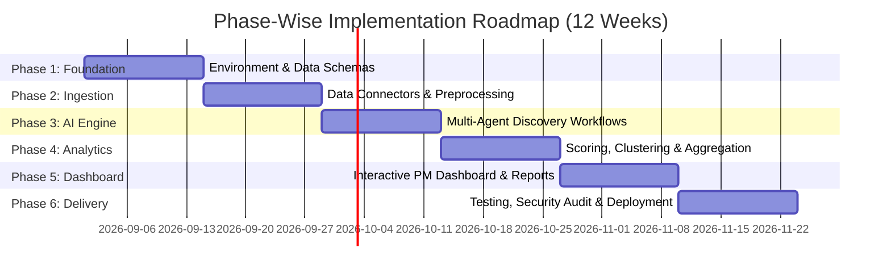

# Implementation Plan: AI-Powered Discovery Engine for Myntra Wishlist-to-Purchase Behavior

This document outlines the phase-wise implementation roadmap for building the **AI-Powered Discovery Engine**. The plan translates the requirements from [context.md](file:///d:/anita/product-AI-training/ai-powered-discovery-engine/context.md) and technical architecture from [architecture.md](file:///d:/anita/product-AI-training/ai-powered-discovery-engine/architecture.md) into actionable development phases.

---

## Roadmap Overview



---

## Phase 1: Environment Setup, Data Models & Foundation (Weeks 1–2)

### Goals
Establish the repository structure, define core Pydantic data schemas, set up relational and vector databases, and prepare dev environments.

### Tasks & Deliverables
1. **Repository & Directory Structure Initialization:**
   - Establish module layout:
     ```
     ai-powered-discovery-engine/
     ├── src/
     │   ├── ingestion/       # Scrapers, API connectors, crawlers
     │   ├── preprocessing/   # Sanitization, PII removal, LSH deduplication
     │   ├── storage/         # DuckDB / Postgres and ChromaDB connectors
     │   ├── agents/          # LangGraph multi-agent processing engine
     │   ├── analytics/       # Opportunity scoring, HDBSCAN clustering
     │   └── dashboard/       # Streamlit / Next.js presentation layer
     ├── tests/
     ├── configs/
     └── requirements.txt / pyproject.toml
     ```
2. **Data Taxonomy & Schema Implementation:**
   - Create Pydantic data models for `RawPost`, `AnalyzedInsight`, and `OpportunityArea` based on [architecture.md](file:///d:/anita/product-AI-training/ai-powered-discovery-engine/architecture.md#5-data-taxonomy--schema-definitions).
3. **Database Initialization:**
   - Set up **DuckDB** connection manager and create relational tables (`raw_posts`, `analyzed_insights`, `opportunity_areas`).
   - Set up **ChromaDB** client, configure distance metrics (cosine), and define collection schemas for text embeddings.
4. **Environment Configuration:**
   - Configure secrets management (`.env` for API keys: OpenAI, Anthropic, Reddit, YouTube, App Store APIs).

### Exit Criteria
- Unit tests validating Pydantic schema validation.
- Operational DuckDB and ChromaDB storage instances initialized via automated scripts.

---

## Phase 2: Multi-Source Data Ingestion & Preprocessing Pipeline (Weeks 3–4)

### Goals
Build scalable, reliable data ingestion connectors for public user feedback channels, along with a sanitization and deduplication pipeline.

### Tasks & Deliverables
1. **Data Connector Modules:**
   - **Google Play & App Store Connector:** Fetch public reviews for the Myntra app with keyword filtering (`wishlist`, `saved`, `size`, `price`, `return`).
   - **Reddit Scraper Module:** Implement PRAW connector fetching posts/comments from target subreddits (`r/IndianFashionAddicts`, `r/ShoppingDealsIndia`).
   - **YouTube Data API Connector:** Retrieve comments from fashion try-on hauls, review videos, and styling recommendations.
2. **Preprocessing & Sanitization Pipeline:**
   - Implement **PII Sanitizer** using Regex and SpaCy Named Entity Recognition (NER) to strip names, emails, phone numbers, and handle tags.
   - Implement **Canonical Term Normalizer** (standardizing slang: *OOTD*, *COD*, *haul*, *BOGO*).
3. **Deduplication Engine:**
   - Implement MinHash / Locality-Sensitive Hashing (LSH) to filter duplicate cross-platform comments.
4. **Staging Pipeline Integration:**
   - Automatically write raw and sanitized outputs into Parquet/JSONL files and DuckDB `raw_posts` table.

### Exit Criteria
- Ingestion pipeline successfully collects 10,000+ public sample posts across 4 channels.
- 100% pass rate on automated PII scrubbing verification tests.

---

## Phase 3: Multi-Agent AI Processing Engine Development (Weeks 5–6)

### Goals
Develop and orchestrate the multi-agent LLM pipeline to classify wishlist motivation, purchase intent, conversion blockers, social validation, and user segments.

### Tasks & Deliverables
1. **Agent State Graph Orchestrator (LangGraph / CrewAI):**
   - Define state schema and execution graph for multi-agent dispatch and parallel execution.
2. **Specialized Agent Implementation:**
   - **Ingestion & Triage Agent:** Filters non-fashion noise and assesses relevance.
   - **Wishlist Motivation Agent:** Classifies intent into `HIGH_BUYING_INTENT`, `PRICE_DISCOUNT_WATCH`, `STYLING_OCCASION_MATCHING`, `COMPARISON_DECISION`, `LOW_INTENT_BOOKMARKING`.
   - **Purchase Blocker Agent:** Identifies friction categories (`SIZE_FIT_UNCERTAINTY`, `PRICE_VALUE_SKEPTICISM`, `QUALITY_FABRIC_CONCERN`, `REVIEW_TRUST_DEFICIT`, `DELIVERY_RETURN_FRICTION`).
   - **Social Validation Agent:** Detects off-platform search behaviors (`YOUTUBE_HAUL_SEARCH`, `INSTAGRAM_LOOKUP`, `REDDIT_ADVICE`).
   - **User Segmentation Agent:** Maps user posts to personas (`BUDGET_SAVER`, `FIT_CONSCIOUS`, `TREND_SHOPPER`, `QUALITY_SEEKER`).
   - **Insight Synthesis Agent:** Merges individual outputs into a validated `AnalyzedInsight` JSON record.
3. **Prompt Engineering & Evaluation:**
   - Build a gold-standard ground-truth dataset (200 manually annotated comments).
   - Benchmark agent classification accuracy (Target: >85% F1-score across intent and blocker classes).

### Exit Criteria
- Multi-agent graph executes end-to-end with structured, validated output matching `AnalyzedInsight` schema.
- Benchmark F1-score meets quality threshold on test dataset.

---

## Phase 4: Analytics, Scoring & Unmet Need Extraction Engine (Weeks 7–8)

### Goals
Compute statistical aggregations, implement the Opportunity Score formula, and apply vector clustering to discover unmapped user friction points.

### Tasks & Deliverables
1. **Opportunity Scoring Module:**
   - Implement the mathematical scoring formula in Python/DuckDB:
     $$\text{Opportunity Score} = F \times \bar{I} \times S$$
     (Frequency $\times$ Average Intent Score $\times$ Severity Weight).
2. **Vector Clustering Pipeline (HDBSCAN):**
   - Extract embeddings for posts classified with `HIGH_BUYING_INTENT` but `NO_PURCHASE`.
   - Run HDBSCAN clustering in ChromaDB vector space to discover implicit/unmapped friction clusters.
3. **Automated Topic Summarizer:**
   - Use LLM to auto-generate descriptive titles, summaries, and representative quotes for each newly discovered cluster.
4. **Data Warehouse Aggregations:**
   - Generate summary views in DuckDB for breakdown by segment, platform, theme, and intent score.

### Exit Criteria
- Calculated Opportunity Matrix ranking all identified conversion barriers by score.
- HDBSCAN pipeline successfully isolates and names novel, unclassified friction clusters.

---

## Phase 5: Interactive Discovery Dashboard & Reporting Interface (Weeks 9–10)

### Goals
Build an intuitive, interactive Streamlit/Next.js dashboard for product managers and leadership to explore insights, metrics, and verbatim user feedback.

### Tasks & Deliverables
1. **Executive Insight Overview:**
   - KPI Cards: Total Posts Analyzed, High-Intent Conversion Drop-off %, Top Blocker.
   - Wishlist Motivation Breakdown Chart & Friction Funnel.
2. **Interactive Opportunity Matrix:**
   - 2D Scatterplot mapping **Frequency** (X-axis) vs **Purchase Intent** (Y-axis) with bubble size representing Opportunity Score.
3. **Verbatim Quote Explorer:**
   - Searchable table allowing PMs to filter quotes by blocker category, user segment, intent level, and source platform (Reddit vs Play Store vs YouTube).
4. **Executive Brief & PDF Export Module:**
   - Automated report generator producing Markdown and PDF discovery briefs summarizing top prioritized opportunity areas for product discovery.

### Exit Criteria
- Dashboard runs locally and renders real-time queries against DuckDB & ChromaDB.
- PM usability testing passed with clean navigation and verbatim inspection.

---

## Phase 6: Integration, Evaluation, Security Audit & Deployment (Weeks 11–12)

### Goals
Perform end-to-end integration testing, security and privacy compliance audits, cost optimization, and deployment.

### Tasks & Deliverables
1. **End-to-End Integration Testing:**
   - Test full workflow: Live Data Ingestion $\rightarrow$ Preprocessing $\rightarrow$ Multi-Agent Processing $\rightarrow$ Scoring $\rightarrow$ Dashboard Refresh.
2. **Cost Optimization & Caching:**
   - Implement **Redis Semantic Caching** to cache LLM responses for redundant/similar text snippets, reducing API costs by 30%+.
3. **Security & Privacy Audit:**
   - Validate PII removal guarantee across vector payload stores and relational DB logs.
4. **Deployment & CI/CD Setup:**
   - Containerize engine using Docker (`Dockerfiles` for Ingestion Worker, Agent Pipeline, and Streamlit Dashboard).
   - Set up scheduled ingestion cron jobs for automated weekly discovery updates.
5. **Final Project Handover:**
   - Publish complete walkthrough, API documentation, and user guide.

### Exit Criteria
- Zero critical PII leaks detected during automated security audit.
- Full pipeline execution verified on fresh batch of public user feedback.
- Deployment container built and running successfully.

---

## Risk Management & Mitigation Matrix

| Potential Risk | Impact | Likelihood | Mitigation Strategy |
| :--- | :--- | :--- | :--- |
| **API Rate Limiting / Scraper Blocking** | High | Medium | Implement proxy rotation, exponential backoff, and caching of raw API responses. |
| **High LLM API Costs** | Medium | High | Use semantic caching, route lower-complexity tasks to smaller models (e.g. GPT-4o-mini), and batch requests. |
| **Low Classification Accuracy on Fashion Slang** | Medium | Medium | Maintain custom canonical term dictionary and fine-tune prompts with few-shot domain examples. |
| **PII Contamination in Public Comments** | High | Low | Enforce multi-pass regex + SpaCy NER PII scrubbing before any vector embedding or database write. |
