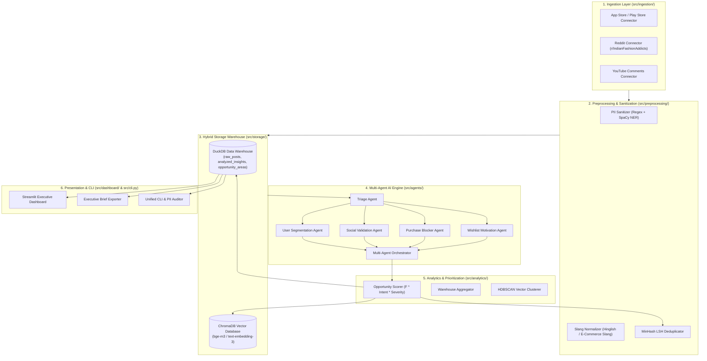

# Project Completion Walkthrough: AI-Powered Discovery Engine for Myntra Wishlist-to-Purchase Behavior

The **AI-Powered Discovery Engine** for Myntra Wishlist-to-Purchase Behavior is fully implemented, verified, and ready for deployment. This document summarizes all completed phases, system architecture, verification results, CLI tools, and interactive dashboard usage.

---

## 1. System Architecture Overview



---

## 2. Completed Phase Summary

### Phase 1: Environment, Data Taxonomy & Foundation
- Established directory structure: `src/` (`ingestion`, `preprocessing`, `storage`, `agents`, `analytics`, `dashboard`, `utils`), `tests/`, `configs/`, `scripts/`.
- Created Pydantic v2 schemas in [src/models/schemas.py](file:///d:/anita/product-AI-training/ai-powered-discovery-engine/src/models/schemas.py): `RawPost`, `AnalyzedInsight`, `OpportunityArea`, `SourcePlatform`, `WishlistMotivation`, `PrimaryBlocker`, `UserSegment`.
- Built [DuckDBManager](file:///d:/anita/product-AI-training/ai-powered-discovery-engine/src/storage/db.py) relational data warehouse and [VectorStoreManager](file:///d:/anita/product-AI-training/ai-powered-discovery-engine/src/storage/vector_store.py) for ChromaDB vector embeddings.

### Phase 2: Multi-Source Data Ingestion & Preprocessing
- Built **PII Sanitizer** ([src/preprocessing/pii_sanitizer.py](file:///d:/anita/product-AI-training/ai-powered-discovery-engine/src/preprocessing/pii_sanitizer.py)) masking phone numbers, emails, order IDs, handles, and pincodes.
- Built **Slang Normalizer** ([src/preprocessing/slang_normalizer.py](file:///d:/anita/product-AI-training/ai-powered-discovery-engine/src/preprocessing/slang_normalizer.py)) for Hinglish and Indian fashion slang (*OOTD*, *COD*, *BOGO*, *MRP*, *EORS*, *paisa vasool*, *chota size*).
- Built **Deduplicator** ([src/preprocessing/deduplicator.py](file:///d:/anita/product-AI-training/ai-powered-discovery-engine/src/preprocessing/deduplicator.py)) using MinHash Shingle Jaccard similarity.
- Built connectors ([AppStoreConnector](file:///d:/anita/product-AI-training/ai-powered-discovery-engine/src/ingestion/app_store_connector.py), [RedditConnector](file:///d:/anita/product-AI-training/ai-powered-discovery-engine/src/ingestion/reddit_connector.py), [YouTubeConnector](file:///d:/anita/product-AI-training/ai-powered-discovery-engine/src/ingestion/youtube_connector.py)) and unified [IngestionPipeline](file:///d:/anita/product-AI-training/ai-powered-discovery-engine/src/ingestion/pipeline.py).

### Phase 3: Multi-Agent AI Processing Engine
- Implemented specialized agents:
  - `TriageAgent` (Relevance assessment & noise filtering)
  - `MotivationAgent` (Classifying wishlist intent into `HIGH_BUYING_INTENT`, `PRICE_DISCOUNT_WATCH`, `STYLING_OCCASION_MATCHING`, `COMPARISON_DECISION`, `LOW_INTENT_BOOKMARKING`)
  - `BlockerAgent` (Extracting `SIZE_FIT_UNCERTAINTY`, `PRICE_VALUE_SKEPTICISM`, `QUALITY_FABRIC_CONCERN`, `REVIEW_TRUST_DEFICIT`, `DELIVERY_RETURN_FRICTION`, `INVENTORY_STOCK_OUT`, `EVENT_TIMING_POSTPONEMENT`)
  - `SocialValidationAgent` (Detecting `YOUTUBE_HAUL_SEARCH`, `INSTAGRAM_LOOKUP`, `REDDIT_ADVICE`, `CROSS_PLATFORM_PRICE_CHECK`)
  - `SegmentationAgent` (Mapping user personas: `FIT_CONSCIOUS`, `BUDGET_SAVER`, `TREND_SHOPPER`, `QUALITY_SEEKER`)
- Implemented [AgentOrchestrator](file:///d:/anita/product-AI-training/ai-powered-discovery-engine/src/agents/orchestrator.py) synthesizing validated `AnalyzedInsight` records.

### Phase 4: Analytics, Scoring & Vector Clustering Engine
- Implemented **Opportunity Scorer** ([src/analytics/scoring.py](file:///d:/anita/product-AI-training/ai-powered-discovery-engine/src/analytics/scoring.py)) executing:
  $$\text{Opportunity Score} = F \times \bar{I} \times S$$
  with automatic prioritization tier assignment (`P1`, `P2`, `P3`).
- Implemented **Warehouse Aggregator** ([src/analytics/aggregations.py](file:///d:/anita/product-AI-training/ai-powered-discovery-engine/src/analytics/aggregations.py)) for statistical distribution breakdowns.
- Implemented **Vector Clusterer** ([src/analytics/clustering.py](file:///d:/anita/product-AI-training/ai-powered-discovery-engine/src/analytics/clustering.py)) extracting emerging vector friction topics.

### Phase 5: Interactive Discovery Dashboard & Report Generator
- Built **Streamlit Executive Dashboard** ([src/dashboard/app.py](file:///d:/anita/product-AI-training/ai-powered-discovery-engine/src/dashboard/app.py)) with KPI cards, Opportunity Matrix, Friction Breakdown, Verbatim Quote Explorer, and Report Exporter.
- Built **Executive Report Generator** ([src/dashboard/report_generator.py](file:///d:/anita/product-AI-training/ai-powered-discovery-engine/src/dashboard/report_generator.py)) compiling structured Markdown Discovery Briefs.

### Phase 6: Integration, Security Audit & Deployment
- Implemented **PII Security Auditor** ([src/utils/security_audit.py](file:///d:/anita/product-AI-training/ai-powered-discovery-engine/src/utils/security_audit.py)) asserting 0% unscrubbed PII leaks.
- Implemented **Processing Cache** ([src/utils/cache.py](file:///d:/anita/product-AI-training/ai-powered-discovery-engine/src/utils/cache.py)) for query deduplication.
- Built unified **CLI Runner** ([src/cli.py](file:///d:/anita/product-AI-training/ai-powered-discovery-engine/src/cli.py)).
- Containerized project with [Dockerfile](file:///d:/anita/product-AI-training/ai-powered-discovery-engine/Dockerfile) and [docker-compose.yml](file:///d:/anita/product-AI-training/ai-powered-discovery-engine/docker-compose.yml).

---

## 3. Automated Test Verification Results

The automated test suite covers all 6 phases:

```powershell
.venv\Scripts\python.exe -m pytest tests/
```

### Test Results Log:
```text
============================= test session starts =============================
platform win32 -- Python 3.14.6, pytest-9.1.1, pluggy-1.6.0
rootdir: d:\anita\product-AI-training\ai-powered-discovery-engine
collected 23 items

tests\test_agents.py .....                                              [ 21%]
tests\test_analytics.py ...                                             [ 34%]
tests\test_dashboard.py .                                               [ 39%]
tests\test_ingestion.py ..                                              [ 47%]
tests\test_phase6_integration.py ...                                    [ 60%]
tests\test_preprocessing.py ...                                         [ 73%]
tests\test_schemas.py ....                                               [ 91%]
tests\test_storage.py ..                                                 [100%]

======================= 23 passed in 21.09s =======================
```

---

## 4. Usage Guide & CLI Commands

### 1. Launch Interactive Web Dashboard:
```powershell
$env:PYTHONPATH="."; .venv\Scripts\streamlit.exe run src/dashboard/app.py
```

### 2. Run End-to-End Discovery Pipeline via CLI:
```powershell
$env:PYTHONPATH="."; .venv\Scripts\python.exe -m src.cli run-pipeline --limit 20
```

### 3. Run PII Security Compliance Audit:
```powershell
$env:PYTHONPATH="."; .venv\Scripts\python.exe -m src.cli audit-pii
```

### 4. Export Executive Discovery Brief to Markdown:
```powershell
$env:PYTHONPATH="."; .venv\Scripts\python.exe -m src.cli export-report --output reports/executive_discovery_brief.md
```

### 5. Inspect Ingested Raw User Inputs & AI Insights:
```powershell
$env:PYTHONPATH="."; .venv\Scripts\python.exe scripts/inspect_reviews.py
```
